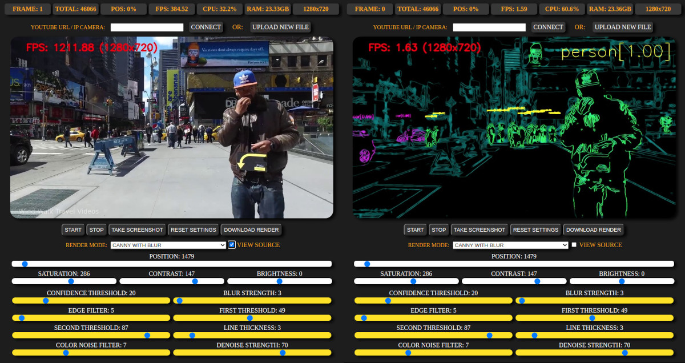
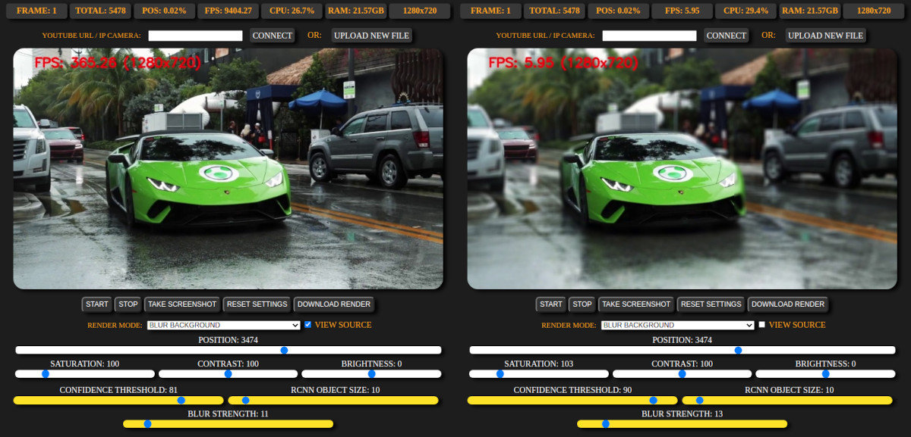
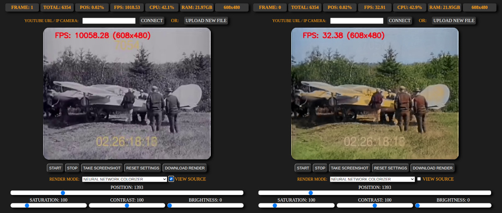
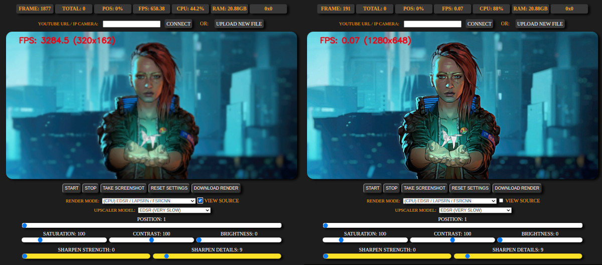
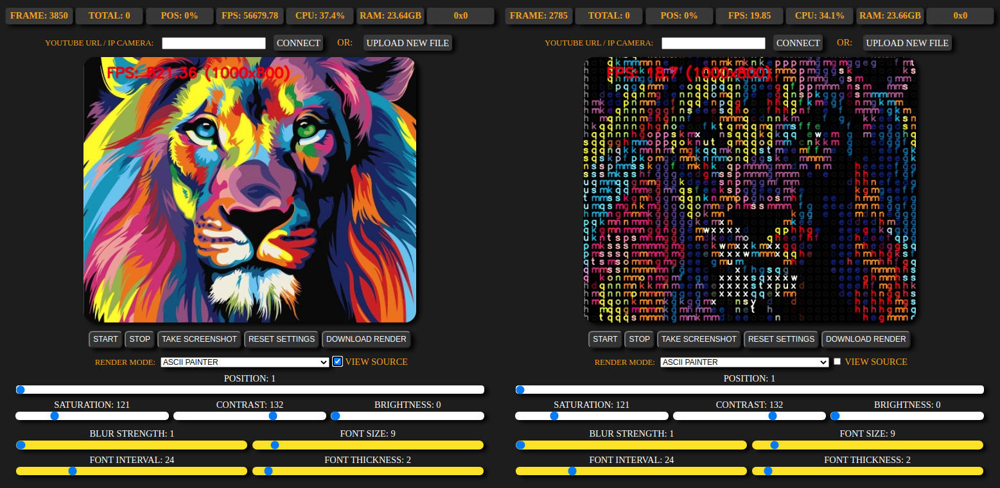
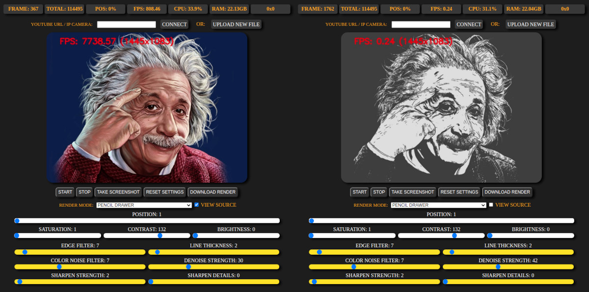
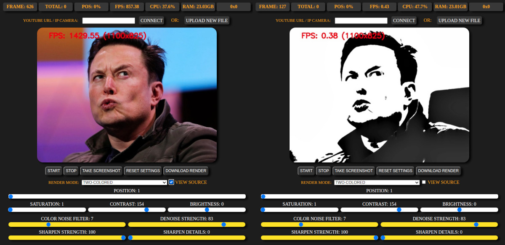
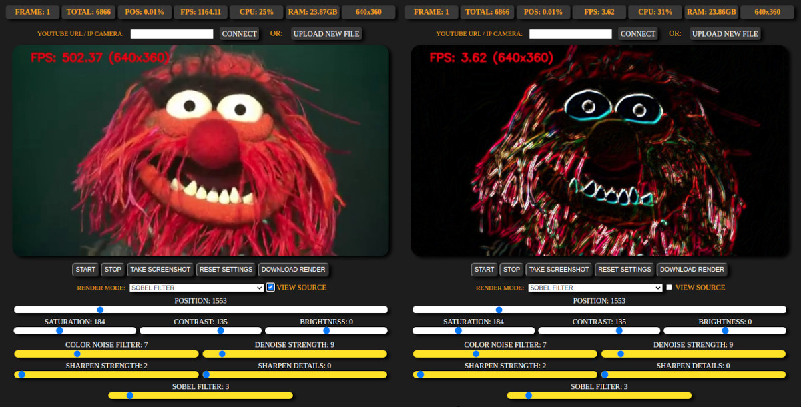

# PyCameraServer
PyCameraServer is a Flask video / image / Youtube / IP Camera frames web-editor with live streaming preview for applying effects, extracting objects and enhancing quality using OpenCV and neural network models: YOLO, Mask R-CNN, Caffe, DAIN, EDSR, LapSRN, FSRCNN, ESRGAN.

[[Project page with demo]](https://alexfcoding.github.io/PyCameraServer/)

## Example: Depth-Aware Video Frame Interpolation and ASCII mode

 

## Main page


## Working editor example


## Models included
YOLO v3 object detector: [Website](https://pjreddie.com/darknet/yolo/) | [GitHub](https://github.com/pjreddie/darknet) | [Paper](https://arxiv.org/pdf/1804.02767.pdf)

Mask R-CNN segmentation: [GitHub](https://github.com/matterport/Mask_RCNN) | [Paper](https://arxiv.org/pdf/1703.06870.pdf)

Colorization with Caffe: [GitHub](http://richzhang.github.io/colorization/) | [Paper](https://arxiv.org/pdf/1603.08511.pdf)

Enhanced SRGAN (ESRGAN): [GitHub](https://github.com/xinntao/ESRGAN) | [Paper](https://arxiv.org/pdf/1809.00219.pdf) | [Pre-trained models](https://upscale.wiki/wiki/Model_Database)

Super-resolution models: [EDSR](https://github.com/Saafke/EDSR_Tensorflow/tree/master/models) - [Paper](https://arxiv.org/pdf/1707.02921.pdf) | [LapSRN](https://github.com/fannymonori/TF-LapSRN/tree/master/export) - [Paper](https://arxiv.org/pdf/1710.01992.pdf) | [FSRCNN](https://github.com/Saafke/FSRCNN_Tensorflow/tree/master/models) - [Paper](https://arxiv.org/pdf/1608.00367.pdf)

Depth-Aware Video Frame Interpolation (DAIN): [GitHub](https://github.com/baowenbo/DAIN) | [Paper](https://arxiv.org/pdf/1904.00830.pdf)

## Supported sources
- **Image files:** png, jpg, gif
- **Video files:** mp4, avi, m4v, webm, mkv
- **Youtube:** URL (video, stream)
- **IP Cameras**: URL for MJPEG camera without login

## Features
16 rendering modes [[Project page with demo]](https://alexfcoding.github.io/PyCameraServer/)
- Detecting and extracting YOLO objects from source (downloading zip with images and labels)
- Fast and easy testing YOLO and Mask R-CNN on different sources
- Applying effects to detected objects and background
- Colorizing grayscale source with Caffe model (old movies for example)
- Restoring resolution with neural network upscalers ESRGAN / PSNR, EDSR / LapSRN / FSRCNN) and selected pre-trained model from page
- Improving smoothness of video or gif and creating slo-mo with Depth-Aware Video Frame Interpolation (DAIN)
- Cleaning with denoise and sharpen
- Stylize with ASCII drawer, cartoon effect, pencil drawer, sobel filter

## Main page
- Animated demo for rendering modes
- Launches separate editor process with selected mode, source and unique port for multiple user connections

## Editor page
- Live Flask streaming preview
- Processing frames with selected mode / settings and downloading video
- Taking screenshot
- Rewinding video file (or Youtube) with slider
- Toggling original / rendered view
- Render mode and settings changing without page reload (AJAX)
- Viewing source info, progress and server stats in real-time (RAM, CPU load, FPS, frame size) 

Note: rendering process stops after a few seconds if user closed browser tab.
 
Simultaneous work on different devices / browser tabs provided by reserving unique user port generated from main page

## Rendering modes
Using neural networks:
- (GPU/CPU) YOLO: Extract objects in frames (download zip with images), draw detected boxes and labels
- (GPU/CPU) YOLO: Blur objects with ASCII chars
- (GPU/CPU) Mask R-CNN: Convert background to gray
- (GPU/CPU) Mask R-CNN: Blur background
- (GPU/CPU) Mask R-CNN: Canny edge detection with masks
- (GPU/CPU) Mask R-CNN: Replace background with video animation
- (GPU) Caffe: colorize grayscale with neural network
- (CPU) EDSR / LapSRN / FSRCNN: x4 resolution upscale
- (GPU) ESRGAN / RRDB_PSNR: x4 resolution upscale (models included: FALCOON, MANGA109, ESRGAN/RRDB_PSNR interpolation 0.2, 0.4, 0.6, 0.8)
- (GPU) Depth-Aware Video Frame Interpolation: create smooth video by creating new frames (boost x2, x4, x8 fps)

Without neural networks:

- (CPU) Denoiser with two sharpening methods
- (CPU) ASCII painter
- (CPU) Cartoon style
- (CPU) Pencil drawer
- (CPU) Sobel filter
- (CPU) Two-colored
 
 ## Tested on
- OS: Ubuntu 20.04 LTS
- GPU: NVIDIA RTX 2060
- NVIDIA driver: 440
- OpenCV 4.3
- CUDA 10.0
- cuDNN 7.6.4
- Python 3.8
- Flask 1.1.2
- PyTorch 1.4.0

## How to run

Main page example (redirects user to editor with specific port and mode):

`python main.py -i 192.168.0.12 -o 8000`

Manual editor page launch:

`python processing.py -i 192.168.0.12 -o 8001 -s my_source -c a -m video`

Args:

- `-i`: server ip

- `-o`: user port

- `-s`: video / image file, Youtube or IP Camera URL. File should be placed in folder "user_uploads"

- `-c`: rendering mode (letters 'a-z')

- `m`: source mode ("ipcam", "youtube", "video", "image")

Ipcam with YOLO detector:

`python processing.py -i 192.168.0.12 -o 8002 -s http://192.82.150.11:8083/mjpg/video.mjpg -c a -m ipcam`

Youtube with ASCII mode:

`python processing.py -i 192.168.0.12 -o 8002 -s https://youtu.be/5JJu-CTDLoc -c q -m youtube`

Video with frame interpolation:

`python processing.py -i 192.168.0.12 -o 8002 -s my_video.avi -c z -m video`

Image with ESRGAN upscaler:

`python processing.py -i 192.168.0.12 -o 8002 -s my_image.jpg -c t -m image`

Check processing.py for other modes

## Dependencies and GPU support
- Follow this manual to compile OpenCV with GPU acceleration (YOLO, Mask R-CNN) and create python virtual environment in Linux: https://github.com/alexfcoding/OpenCV-cuDNN-manual

- Unpack files to folder "models" [[Google Drive](https://drive.google.com/file/d/1GUS7VrHNfc_3oVv-oNEaSUMxWlsUDA4d/view?usp=sharing)]

- Install libraries:
```
$ workon opencv_gpu
$ pip install flask
$ pip install psutil
$ pip install sklearn
$ pip install torch==1.4.0+cu100 torchvision==0.5.0+cu100 -f https://download.pytorch.org/whl/torch_stable.html
$ pip install pafy
$ pip install youtube-dl
```            
- Generate PyTorch extensions and correlation package required by PWCNet for DAIN as described [here](https://github.com/baowenbo/DAIN):    
```
$ workon opencv_gpu
$ cd DAIN
$ cd my_package
$ ./build.sh
```
```
$ cd ../PWCNet/correlation_package_pytorch1_0
$ ./build.sh
```

## Examples
### YOLO: Real-Time Object Detection:
- Downloading zip with detected YOLO image objects
- Rendering and classes counting


---

### YOLO: bluring detected objects with ASCII effect


---

### Mask R-CNN: Object Detection and Segmentation
 - Drawing R-CNN masks with classes and edge detection



---

- Animating background with secondary video and applying colored edge detection to masks


  
---

- Drawing R-CNN masks with grayscale background


---

- Drawing R-CNN masks with blurred background



---
  
### Caffe: neural network colorizer



---

### ESRGAN / RRDB_PSNR: x4 resolution upscaler (GPU)


---
  
### EDSR / LapSRN / FSRCNN: Super Resolution x4 upscaler (CPU)  



---

### Denoise: OpenCV denoiser with two sharpening methods


---

### ASCII Painter: drawing with colored ASCII chars



---

### Cartoon style


---

### Pencil drawer



### Two-colored



### Sobel filter



---
